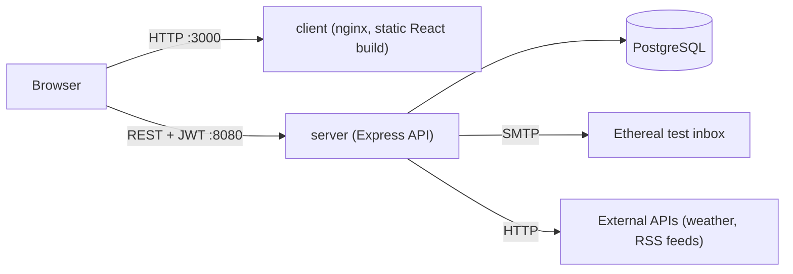

# Developer guide

This guide is for contributors. It explains how the application is built, how to run and configure it, and how to extend it. For end-user instructions, see the [User guide](USER_GUIDE.md).

## Contents

1. [Architecture](#architecture)
2. [Technology choices](#technology-choices)
3. [Getting started](#getting-started)
4. [Configuration](#configuration)
5. [Project structure](#project-structure)
6. [Backend](#backend)
7. [Frontend](#frontend)
8. [Adding a new widget](#adding-a-new-widget)
9. [Security notes](#security-notes)
10. [Docker cheat sheet](#docker-cheat-sheet)
11. [Troubleshooting](#troubleshooting)
12. [Known limitations](#known-limitations)

## Architecture

Three containers, started by Docker Compose:

| Container | Service | Role | Port |
| --- | --- | --- | --- |
| `dashboard_client` | `client` | nginx serving the built React application | 3000 |
| `dashboard_server` | `server` | Express REST API | 8080 |
| `dashboard_postgres` | database | PostgreSQL 16 | 5432 (internal) |



The browser downloads the React application from `client`, then talks to `server` directly. The server owns all business logic: accounts, the per-user dashboard, and fetching data for widgets from external sources.

## Technology choices

| Technology | Why |
| --- | --- |
| **React + TypeScript** | A widget is a self-contained UI unit, which maps directly to a component. TypeScript makes the contract between a widget's config form, its display and the API explicit and checked at compile time. |
| **Vite** | Fast development server and simple production build. |
| **React Router** | Client-side routing with a shared layout (header) and route guards. |
| **TanStack Query** | Handles loading, error and caching states for API calls and widget refreshes instead of hand-written `useEffect` logic. |
| **dnd-kit** | Small, headless drag-and-drop library that leaves the markup and styling to us. |
| **Node.js + Express** | Minimal, unopinionated HTTP layer with a large middleware ecosystem. The same language on both sides keeps shared types and tooling simple. |
| **PostgreSQL** | Relational integrity for users, plus `JSONB` to store each user's widget list without a rigid schema for widget configs. |
| **bcrypt** | Adaptive, salted password hashing. |
| **JWT** | Stateless authentication that suits a single-page app talking to a separate API. Trade-off: tokens cannot be revoked server-side before they expire. |
| **Nodemailer + Ethereal** | Standard SMTP client. Ethereal is a fake SMTP service, so development needs no real mail credentials. |
| **Docker Compose** | One reproducible command to build and run the whole stack. |
| **nginx** | Serves the static frontend build in a very small image. |

## Getting started

**Prerequisites:** Docker with Compose. Check with `docker --version` and `docker compose version`.

```bash
git clone <repository-url>
cd Dashboard (repository name)
```

Create the configuration (see [Configuration](#configuration)):

```bash
echo "JWT_SECRET=$(openssl rand -hex 32)" > .env
```

Build and run:

```bash
docker compose up --build
```

Then open http://localhost:3000. Check the API with `curl http://localhost:8080/about.json`.

On first start the server runs the database migrations and logs `Migration executed : <file>` for each.

### Email confirmation in development

Confirmation emails are sent through Ethereal, a fake SMTP service: nothing reaches a real inbox. For each email the server logs a preview URL:

```bash
docker compose logs server | grep "Preview URL"
```

Open that URL to see the message and click the confirmation link. To use real emails, replace the transport in `backend/src/services/email.ts` with real SMTP credentials.

### Resetting the database

Delete everything (containers and database volume), then start fresh:

```bash
docker compose down -v
docker compose up --build
```

Or keep the tables and empty them:

```bash
docker exec dashboard_postgres sh -c 'psql -U "$POSTGRES_USER" -d "$POSTGRES_DB" -c "TRUNCATE users, dashboards RESTART IDENTITY CASCADE;"'
```

Delete only accounts that were never confirmed:

```bash
docker exec dashboard_postgres sh -c 'psql -U "$POSTGRES_USER" -d "$POSTGRES_DB" -c "DELETE FROM users WHERE is_confirmed = false;"'
```

After resetting the users, log out in the browser (or clear the `dashboard_auth` entry in localStorage): the old token stays valid client-side for up to 7 days.

## Configuration

| Variable | Used by | Default | Description |
| --- | --- | --- | --- |
| `JWT_SECRET` | server | none (**required**) | Secret used to sign login tokens. The server refuses to start without it. |
| `FRONTEND_URL` | server | `http://localhost:3000` | Base URL used to build the link in the confirmation email. |
| `PORT` | server | `8080` | Port of the API. The subject requires 8080. |
| `VITE_API_URL` | client, **build time** | `http://localhost:8080` | API address used by the browser. Vite inlines it at build time, so changing it requires a rebuild (`docker compose up --build`). |
| Database settings | server and database | see `docker-compose.yml` | Credentials and connection details for PostgreSQL. |

Make sure `docker-compose.yml` passes these variables to the `server` service (with `env_file` or `environment`).

## Project structure

```text
Dashboard/
├── docker-compose.yml
├── frontend/
│   └── src/
│       ├── main.tsx              Router and providers
│       ├── index.css             Global styles and design tokens (CSS variables)
│       ├── style/                One CSS file per component
│       ├── routes/               Pages: Dashboard, Login, Register, Verify
│       ├── components/layout/    Layout, Header, RequireAuth
│       ├── context/              AuthContext
│       ├── hooks/                useWidgetData
│       ├── lib/api.ts            Every call to the backend
│       ├── features/services     All the differents widgets 
│       └── features/widgets/     Widget system (see below)
└── backend/
    └── src/
        ├── index.ts              App setup, route mounting, /about.json
        ├── db.ts                 PostgreSQL pool and migrations runner
        ├── routes/               URL to controller mapping
        ├── controllers/          Request handling
        ├── models/               Database queries
        ├── middleware/           requireAuth, error handler
        └── services/             Email
```

## Backend

### API

| Method | Path | Description |
| --- | --- | --- |
| `GET` | `/about.json` | Client host, server time, and the list of services and widgets with their parameters. Public: the subject requires it. |
| `GET` | `/health` | Returns `{ "status": "ok" }`. |
| `POST` | `/api/auth/register` | Body `{ email, password }`. Creates the account and sends the confirmation email. If the email belongs to an **unconfirmed** account, replaces its password and sends a new email. Returns 400 if the email belongs to a confirmed account. |
| `GET` | `/api/auth/verify?token=…` | Confirms the account. Returns 400 if the token is unknown or expired. |
| `POST` | `/api/auth/login` | Body `{ email, password }`. Returns `{ token, user: { email } }`. 401 for bad credentials, 403 if the email is not confirmed. |
| `GET` | `/api/dashboard` | Returns `{ instances }`, the current user's widgets. Requires `Authorization: Bearer <token>`. |
| `PUT` | `/api/dashboard` | Body `{ instances }`. Replaces the current user's widgets. Requires a Bearer token. |
| `POST` | `/widgets/preview` | Body `{ service, widget, config }`. Returns `{ data }`, the data shown by a widget. |

Protected routes use the `requireAuth` middleware, which verifies the JWT and puts `userId` and `userEmail` on the request. The user id always comes from the token, never from the request body.

### Email confirmation and login flow


The email link points to the **frontend** (`/verify`), which then calls the API. This keeps the API a pure JSON service, and stops email link scanners from consuming the single-use token, since they do not run JavaScript.

### Database

Migrations are SQL files run automatically at server start, in order:

| File | Purpose |
| --- | --- |
| `001-users-table.sql` | `users` table |
| `002-add-role-to-users.sql` | `role` column |
| `003-add-verification-token.sql` | `token` and `date` (expiry) columns |
| `004-dashboard-table.sql` | `dashboards` table |

Write new migrations to be idempotent (`IF NOT EXISTS`), like the existing ones, and number them in sequence.

**`users`**

| Column | Type | Notes |
| --- | --- | --- |
| `id` | serial, PK | |
| `email` | varchar, unique | |
| `password` | varchar | bcrypt hash |
| `is_confirmed` | boolean | Default `false` |
| `role` | varchar | Default `'user'` |
| `token` | varchar | Verification token, `NULL` once used |
| `date` | timestamp | Token expiry, `NULL` once used |
| `created_at` | timestamp | |

**`dashboards`**: one row per user.

| Column | Type | Notes |
| --- | --- | --- |
| `user_id` | integer, PK | Foreign key to `users(id)`, `ON DELETE CASCADE` |
| `instances` | jsonb | The user's list of widget instances |
| `updated_at` | timestamp | |

## Frontend

### Routing and layout

`main.tsx` wraps the app in `QueryClientProvider`, then `AuthProvider`, then the router. All routes are nested under `Layout`, which renders the `Header` and the current page.

| Route | Page | Access |
| --- | --- | --- |
| `/` | Dashboard | Logged in only (`RequireAuth` redirects to `/login`) |
| `/login`, `/register` | Auth forms | Public |
| `/verify` | Email confirmation result | Public |

### Authentication state

`AuthContext` keeps the JWT and the user's email, persisted in `localStorage` under the key `dashboard_auth`. It exposes `login`, `logout`, `isAuthenticated` and `isLoading`. `isLoading` is true until the stored session has been read, so `RequireAuth` does not redirect on the first render of a page refresh.

### Dashboard persistence

Each user's widgets live in the database (`dashboards` table), not in the browser:

1. `Dashboard` loads the list with `GET /api/dashboard`. The query key includes the user's email, so accounts never share cached data.
2. Only once loaded does the inner `DashboardContent` mount, so the first render cannot overwrite saved data with an empty list.
3. Every change (add, edit, remove, reorder) triggers `PUT /api/dashboard` with the full list. A JSON comparison with the last saved list avoids redundant saves.
4. A 401 response logs the user out, since the token is expired or invalid.

### Widget system

Located in `features/widgets/`.

```ts
interface WidgetInstance {
  id: string;                    // crypto.randomUUID()
  service: string;               // e.g. "weather"
  widget: string;                // e.g. "city_temperature"
  config: Record<string, unknown>;
  refreshRateSeconds: number;
}
```

| File | Role |
| --- | --- |
| `types.ts` | `WidgetInstance` and the `/about.json` response types |
| `registry.ts` | Maps `service` + `widget` to its display and config form (`getDisplay`, `getConfigForm`) |
| `widget-component-types.ts` | Props contract: `WidgetDisplayProps` (`data`, `isLoading`, `error`) and `WidgetConfigFormProps` (`value`, `onChange`) |
| `WidgetShell.tsx` | The frame around every widget (drag handle, edit and remove buttons, refresh footer). Fetches data with `useWidgetData` and renders the widget's display |
| `AddWidgetDialog.tsx` | Add/edit dialog. Lists services and widgets from `/about.json`, renders the widget's config form and the refresh rate |
| `<service>/<widget>/` | One folder per widget with `Display.tsx` and `ConfigForm.tsx` |

`useWidgetData` calls `POST /widgets/preview` with the instance's service, widget and config, and re-fetches on the instance's refresh interval.

### Styling

Global design tokens (colors, fonts, shadow) are CSS variables in `index.css`, with a dark variant under `prefers-color-scheme`. Each component has its own file in `style/`, named after it, and only uses those variables.

## Adding a new widget

Example: a `github` service with a `latest_commits` widget.

**Backend**

1. Declare it in the `services` array in `index.ts` (this feeds `/about.json`): the widget `name`, a `description`, and its `params`, each with a `name` and a `type` of `string` or `integer`. A widget must have at least one parameter.
2. Implement the data fetching for it, following how `city_temperature` and `article_list` are handled by the widgets route (`POST /widgets/preview`). It receives the `config` object and must return JSON.

**Frontend**

3. Create the folder `github/latest_commits/` next to the existing widgets, with:
   - `ConfigForm.tsx`: an input for each parameter. Keys in the `config` object must match the parameter names declared in step 1. If a parameter needs a default (like `number` in the RSS form), set it in a `useEffect`.
   - `Display.tsx`: renders `data`, and handles `isLoading` and `error`.
4. Register both in `registry.ts` under `github` / `latest_commits`.
5. Add a CSS file in `style/` if the widget needs styles, and import it.

Then restart with `docker compose up --build` and check that the widget appears in `/about.json` and in the **Add widget** dialog.

## Security notes

What is in place:

- Passwords are hashed with bcrypt (cost 10) and never returned by the API.
- Login returns the same error for an unknown email and a wrong password.
- Verification tokens are random (32 bytes), single-use, and expire after 24 hours.
- Accounts must be confirmed before they can log in.
- Dashboard routes derive the user from the signed token, so users can only access their own data.
- The server refuses to start without `JWT_SECRET`.

Known trade-offs, to review before any real deployment:

- The JWT is stored in `localStorage`, readable by any script running on the page (XSS). An `HttpOnly` cookie is the safer alternative.
- Tokens are valid 7 days and cannot be revoked server-side.
- `cors()` allows every origin. Restrict it to the frontend's URL.
- Registration reveals whether an email belongs to a confirmed account.
- There is no rate limiting on login or registration.
- The stack serves plain HTTP. Put it behind TLS in production.

## Docker cheat sheet

Run from the project root. `docker-compose` (Compose v1) accepts the same commands.

| Command | Description |
| --- | --- |
| `docker compose up --build` | Build images and start everything |
| `docker compose up -d` | Start in the background |
| `docker compose down` | Stop and remove the containers |
| `docker compose down -v` | Same, and delete the database volume |
| `docker compose ps` | List the project's containers |
| `docker compose logs -f server` | Follow the API logs (use `client` for the frontend) |
| `docker compose exec server sh` | Open a shell in the API container |
| `docker exec -it dashboard_postgres sh -c 'psql -U "$POSTGRES_USER" -d "$POSTGRES_DB"'` | Open a `psql` session (`\q` to leave) |

Rebuild (`--build`) after changing a Dockerfile or a dependency. `npm run build` is what the Dockerfiles run for both `frontend` and `backend`; other scripts are in each `package.json`.

## Troubleshooting

| Problem | Cause and fix |
| --- | --- |
| `server` exits with `JWT_SECRET is not set` | Add `JWT_SECRET` to `.env` and make sure Compose passes it to the `server` service. |
| Registration returns 404 | The auth router must be mounted at `/api/auth` in `index.ts`. |
| `service "…" is not running` with `docker compose exec` | The stack is not up (`docker compose up -d`), or the name is not a Compose service name. Check with `docker compose ps`, or use `docker exec <container_name>`. |
| Warning: `configured to build using Bake, but buildx isn't installed` | Harmless. |
| `permission denied while trying to connect to the Docker daemon` | Start Docker (`sudo systemctl start docker`) and add your user to the `docker` group: `sudo usermod -aG docker $USER`, then log out and back in. |
| `bind: address already in use` | Another program uses port 3000, 8080 or 5432. Find it with `sudo lsof -i :8080`, or change the port mapping in `docker-compose.yml`. |
| Frontend cannot reach the API after changing `VITE_API_URL` | It is inlined at build time. Rebuild with `docker compose up --build`. |
| Confirmation email never arrives | Emails go to Ethereal in development. Use the `Preview URL` in the server logs. |
| A container keeps restarting | Read its logs: `docker compose logs <service>`. |

## Known limitations

- Users do not subscribe to services: every service is available to every logged-in user, and there is no OAuth linking to third-party accounts.
- No administration section.
- No dedicated "resend confirmation email" endpoint: registering again with the same email does the same job.